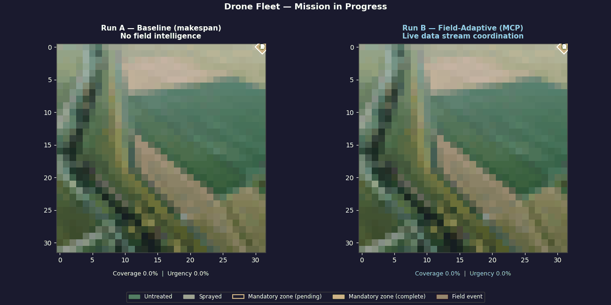
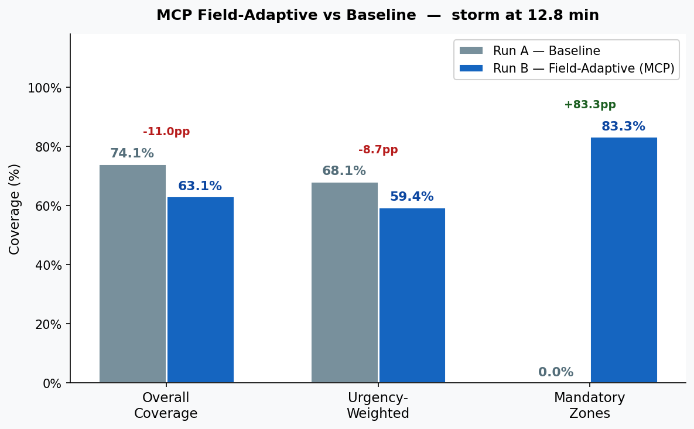

# Drone Fleet Optimizer — Failure-Aware Mission Planning

A research prototype exploring what happens to autonomous drone fleet performance when things go wrong — solver timeouts, drone failures, live weather events — and how to bound that damage.

Built as a systems design project, not a pure optimization project. The value is in understanding failure modes and graceful degradation, not in achieving theoretical optimality.

---

## Demo

> Run A follows the original mission plan unchanged. Run B uses Claude (via MCP) to adapt mid-mission to live weather alerts, pest sightings, and sensor events.



**At storm deadline — baseline vs AI-adaptive:**



The AI-adaptive run trades 11 percentage points of overall coverage to achieve **83.3% mandatory zone coverage** — vs 0% for the baseline plan that flew into the storm unchanged.

---

## What It Does

- **Assigns drone fleets to field strips** using a MILP makespan optimizer, with heuristic fallback when the solver times out or returns infeasible
- **Simulates mission execution** with configurable battery drain, mechanical failures, and comms loss
- **Connects to live field events** via MCP: weather alerts, pest sightings, NDVI anomalies, and sensor data trigger mid-mission replanning
- **Quantifies degradation** across Monte Carlo runs — coverage loss, time-to-recovery, energy waste, and variance across failure rates

---

## How It Works

```
Aerial image / synthetic grid
        ↓
Strip generator  (boustrophedon, configurable orientation)
        ↓
Fleet optimizer  (MILP — makespan or weighted objective)
        ↓
Simulation engine  (battery drain, failures, replanning loop)
        ↓
MCP event stream   (weather, pests, sensors → Claude coordinator)
        ↓
Visualization / metrics
```

### Three-Tier Planner

The system never crashes on an infeasible plan:

| Mode | When triggered | Approach |
|---|---|---|
| **Full MILP** | Sufficient time, stable state | Full horizon, all constraints |
| **Degraded MILP** | Time pressure or high uncertainty | Shorter horizon, relaxed constraints, skip unreliable drones |
| **Heuristic fallback** | Timeout or infeasible | Greedy nearest-strip — always fast, always feasible |

Mode selection is automatic via `PlannerContext` (time budget, state uncertainty, battery threshold).

---

## AI Coordination


*Mid-flight: Claude processes a simultaneous weather alert, aphid cluster detection, fungal lesion sightings, and NDVI anomalies. It reclassifies affected strips as mandatory, reweights priorities, and reoptimizes with 5 minutes to storm arrival.*


*Post-storm: baseline plan achieved 0% priority coverage. AI-adaptive plan achieved 100% priority coverage — at the cost of overall coverage — by concentrating the remaining fleet on the strips that mattered.*

The coordinator uses MCP tool calls to read field state, query active events, and trigger replanning. The decision log shows its reasoning in plain language.

---

## Key Metrics

The project reports operator-relevant outcomes, not solver statistics:

| Metric | What it measures |
|---|---|
| % mission completed | Primary outcome |
| Mandatory zone coverage | Did the critical areas get treated? |
| Time to recovery after failure | How fast does replanning restore progress? |
| Urgency-weighted coverage | Priority-adjusted outcome |
| Variance across MC runs | Is the system predictable? |

---

## Quick Start

**CLI (headless simulation):**
```bash
python -m venv .venv && source .venv/bin/activate  # Windows: .venv\Scripts\activate
pip install -r requirements.txt

# Basic run
python run_simulation.py

# With failures injected
python run_simulation.py --failures --n-drones 4

# Weighted objective, save GIF
python run_simulation.py --objective weighted --save results/run.gif
```

**Interactive UI (requires `ANTHROPIC_API_KEY` for AI coordination):**
```bash
export ANTHROPIC_API_KEY=sk-ant-...
bash start_ui.sh
# Backend: http://localhost:8000
# Frontend: http://localhost:5173
```

**Notebooks:**
```
notebooks/
  phase1_walkthrough.ipynb       # Core simulation loop
  phase2_degraded_planner.ipynb  # Three-tier planner + Monte Carlo
  phase3_real_fields.ipynb       # Real aerial imagery pipeline
```

---

## Tech Stack

| Layer | Library |
|---|---|
| Optimization | PuLP / OR-Tools |
| Simulation | Python (custom) |
| AI coordination | Claude via MCP (`anthropic` SDK) |
| Backend API | FastAPI + uvicorn |
| Frontend | React + Vite |
| Visualization | matplotlib |
| Data | numpy, pandas, scikit-learn |

---

## Project Framing

**What this demonstrates:**
- A system designed around failure, not despite it
- How to bound coverage loss when optimization fails mid-mission
- What operators actually care about (mandatory zone compliance, not optimality gaps)
- AI coordination that reasons about trade-offs in plain language

**What this is not:**
- A production-ready agriculture platform
- An optimal planner (optimal is the wrong goal when replanning must happen in seconds)
- A claim to outperform all heuristics

---

## Branch

The [`reforestation` branch](../../tree/reforestation) adapts this framework to mangrove coastal restoration — tidal deadline constraints, mudflat soil detection from aerial imagery, and contour-based seed dispersal.
