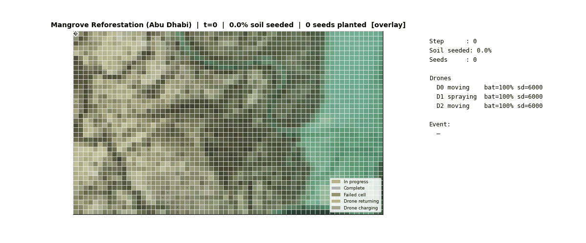
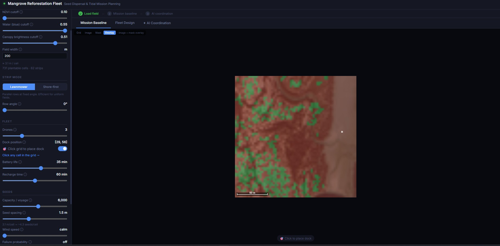
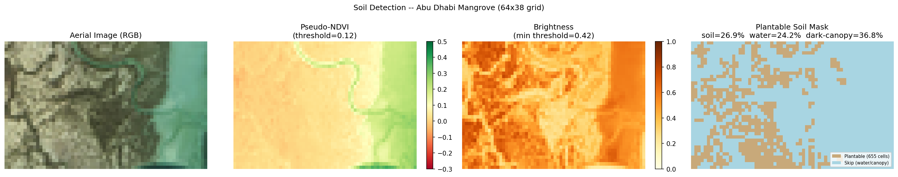
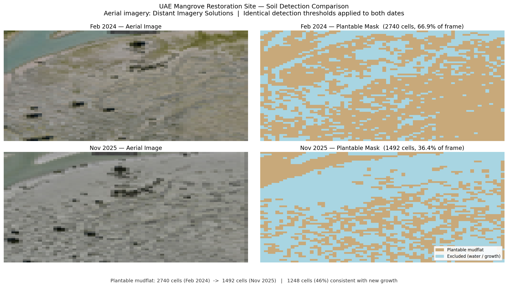

# Mangrove Reforestation Fleet — AI-Coordinated Seed Dispersal

An adaptive drone fleet planning system for large-scale mangrove restoration on coastal mudflats. The fleet plans missions from aerial imagery, operates under hard operational deadlines, and replans in real time when drones fail or conditions change.

Built on a failure-aware optimization framework. When a deadline arrives — tidal surge, weather window, permit expiry — whatever hasn't been planted is lost. The system is designed around that reality.

---

## Demo



*A 6-drone fleet seeds plantable mudflats following contour-aligned strips derived from real aerial imagery of Jubail Mangrove Park. Drones return to dock when the seed hopper empties, reload, and resume. When a hard deadline is detected, the AI coordinator reassigns remaining capacity to the highest-priority zones before the window closes.*

---

## The Problem

Restoring degraded coastal habitat at scale means planting millions of propagules across terrain that is:

- **Physically inaccessible** at the densities needed — soft mudflats impassable on foot
- **Time-constrained** — hard operational deadlines govern what gets planted. Tidal cycles are one example: a surge can close viable planting windows within hours. Seasonal ecological windows and permit timelines create the same kind of forcing function.
- **Heterogeneous** — open water, existing growth, and bare mudflat are interleaved; not all ground is plantable
- **Priority-sensitive** — areas near tidal channels have significantly higher germination rates; losing those strips to a planning gap is a disproportionate loss

A drone fleet without intelligent coordination is a fixed-route tool. When something goes wrong, the script breaks.

---

## Key Result


*Hard deadline arrives with 4 minutes remaining. Baseline plan: 14.1% overall coverage, 0.0% high-priority mudflat coverage. AI-adaptive plan: 13.3% overall coverage, **20.8% high-priority mudflat coverage**. The coordinator trades marginal overall coverage to protect the zones that matter for germination.*

---

## Mission Planner



*Mission Baseline tab: the aerial image is overlaid with the plantable cell mask — green cells are bare mudflat flagged for seeding, brown areas are excluded (canopy or water). The left panel sets detection thresholds (NDVI, blue-channel, brightness), strip mode (lawnmower or shore-first), row angle, fleet configuration, and seed parameters. Clicking any cell on the grid places the charging dock.*

All parameters feed directly into the planner and simulator. Adjusting NDVI or brightness thresholds immediately updates the plantable mask and strip count.

---

## Soil Detection Pipeline



*Aerial imagery: [Distant Imagery Solutions](https://www.linkedin.com/posts/distant-imagery-solutions_makeitintheemirates-uae-abudhabi-activity-7452634016509255680-j7p0) — UAE mangrove restoration site. Used with reference to demonstrate real-world soil detection on coastal imagery.*

The system takes a raw aerial RGB image and automatically identifies plantable mudflat, excluding open water and existing canopy:

1. **Pseudo-NDVI** from RGB channels — isolates tidal water (high NDVI threshold)
2. **Blue-channel filter** — backup exclusion for shallow tidal areas
3. **Brightness mask** — excludes dark canopy
4. **Plantable soil mask** — what remains is the planting surface (~26.9% of this field)

All thresholds are configurable. A production deployment would use actual NIR imagery for a true NDVI signal.

---

## Real-World Validation: UAE Mangrove Restoration Site



The before/after aerial images from Distant Imagery Solutions cover the same section of a UAE mangrove restoration site, photographed approximately 21 months apart (February 2024, November 2025). Running both images through the soil detection pipeline with identical thresholds produces a useful directional check: does the system correctly detect the growth that actually occurred?

- Feb 2024 plantable mudflat: 2,740 cells (66.9% of the frame)
- Nov 2025 plantable mudflat: 1,492 cells (36.4% of the frame)

The pipeline identifies substantially less bare mudflat in the 2025 image — consistent with new growth covering previously exposed sediment. This is the core function the app depends on: distinguishing existing growth from bare mudflat to determine where dropping additional seeds makes sense. Areas already supporting growth are correctly excluded as non-candidates; exposed sediment is flagged as plantable. The before/after comparison suggests the detector is picking up genuine ecological change rather than noise.

This is not a full validation of the method — the images differ in tidal state, the crop alignment isn't guaranteed, and RGB brightness cannot perfectly separate juvenile growth from shadows or sediment texture. But it is at least *directionally* consistent with what happened on the ground.

**As an aside**, treating the converted cells as a rough proxy for establishment: 1,248 of the 2,740 (2024) plantable cells appear to have transitioned to growth by 2025, implying ~45% change in bare mudflat coverage. A 2023 ADIPEC paper by AlRaisi et al. on ADNOC's drone-led mangrove restoration at Abu Dhabi sites reported survival rates "remained above 40%".<sup>1</sup> The ~45% figure from this single cropped frame is in the same order of magnitude — plausible given the RGB-only method — but should not be read as a survival rate estimate. A [February 2023 article in The Ethicalist](https://theethicalist.com/drones-million-mangrove-abu-dhabi/) provides additional public context on the broader programme.


*Source imagery from the [Distant Imagery Solutions LinkedIn post](https://www.linkedin.com/posts/distant-imagery-solutions_makeitintheemirates-uae-abudhabi-activity-7452634016509255680-j7p0) documenting the UAE restoration site.*

> <sup>1</sup> AlRaisi, A. A., Al Hameedi, S., AlBuainain, R. M., Glavan, J., and C. Rhodes. "Restoration Technology Hand in Hand With Nature-Based Solutions: ADNOC's Drone Led Mangrove Restoration Project." ADIPEC, Abu Dhabi, UAE, October 2023. [doi:10.2118/215963-MS](https://doi.org/10.2118/215963-MS)

---

## Fleet Design


Before committing a fleet to a mission, the Fleet Design module acts as a digital twin: run the same mission dozens of times under different configurations, failure probabilities, and environmental conditions — all in minutes, before any real asset is deployed.

**Sample comparison:**
- **Config A** (6 drones, 35% failure probability): median 2,679 steps, worst-case 3,107
- **Config B** (8 drones, 40% failure probability): median 2,525 steps, worst-case 2,655

2 additional drones with a 5-point higher failure rate still cuts median mission time by 6% and worst-case time by 15%. Monte Carlo sweeps across failure rates and fleet sizes surface these trade-offs before launch.

**Adjustable parameters:**
- Fleet size and per-drone failure probability
- Seed spacing and hopper capacity per voyage
- Wind speed (battery drain penalty)
- Battery life and recharge time
- Ecology survival rate and strip planting priority

---

## How It Works

```
Aerial image  (real or synthetic)
        ↓
Soil detector  (NDVI + blue + brightness masks → plantable cells)
        ↓
Strip generator  (lawnmower or contour-aligned strips)
        ↓
Fleet optimizer  (MILP makespan — with heuristic fallback)
        ↓
Simulation engine  (battery drain, seed hopper, drone failures, hard deadlines)
        ↓
MCP event stream  (deadline alerts, field state → Claude coordinator)
        ↓
Visualization / metrics
```

### Planner Tiers

The system never halts on an infeasible plan:

| Mode | When triggered | Approach |
|---|---|---|
| **Full MILP** | Time available, stable state | Full horizon, hard battery and capacity constraints |
| **Degraded MILP** | Time pressure | Shorter horizon, skip unreliable drones |
| **Heuristic fallback** | Timeout or infeasible | Greedy nearest-strip — always fast, always produces a plan |

---

## AI Coordination

The AI coordinator connects to the simulation via MCP and acts as a live mission supervisor:

1. Reads current field state — what has been seeded, what remains
2. Receives deadline alerts — how long until cutoff, which zones will be blocked
3. Designates high-priority strips as must-complete before the deadline
4. Requests a revised plan concentrating remaining fleet capacity on those strips
5. Reports the outcome with plain-language reasoning

The decision log shows not just what the system decided, but why — which field events triggered which actions.

---

## Quick Start

**Interactive UI (requires `ANTHROPIC_API_KEY` for AI coordination):**
```bash
python -m venv .venv && source .venv/bin/activate  # Windows: .venv\Scripts\activate
pip install -r requirements.txt

export ANTHROPIC_API_KEY=sk-ant-...
bash start_ui.sh
# Backend: http://localhost:8000
# Frontend: http://localhost:5173
```

**CLI (headless pipeline):**
```bash
python run_mangrove.py
# Runs full UAE mangrove mission: soil detection → strip generation → MILP → simulation → GIF
```

**Notebook:**
```
notebooks/phase5_reforestation.ipynb  # End-to-end walkthrough with contour planting
```

---

## Tech Stack

| Layer | Library |
|---|---|
| Optimization | PuLP / OR-Tools |
| Simulation | Python (custom) |
| AI coordination | Claude via MCP (`anthropic` SDK) |
| Soil detection | numpy, Pillow (pseudo-NDVI from RGB) |
| Backend API | FastAPI + uvicorn |
| Frontend | React + Vite |
| Visualization | matplotlib |

---

## Honest Limitations

This is a research prototype built to demonstrate the planning and coordination architecture:

- **No real aircraft integration** — simulation uses representative parameters, not live telemetry
- **Static soil detection** — the aerial image is taken before the mission; dynamic sensing during flight would need a live data feed
- **No regulatory layer** — geofencing, airspace deconfliction, and emergency protocols are not modeled
- **Survival rates are fixed estimates** — actual germination depends on factors well outside flight planning scope

These are integration problems, not architectural ones. The core loop — soil analysis, adaptive planning, failure-aware execution, AI-assisted coordination — is designed to be extended.

---

## Optimization, Simulation, and AI — How They Fit Together

### Fleet Assignment: MILP Formulation

The fleet assignment problem is a makespan-minimization variant of the bin-packing problem, solved with a Mixed-Integer Linear Program (MILP) via PuLP / CBC.

**Sets**

| Symbol | Meaning |
|--------|---------|
| $D$ | Set of drones $\{d_1, \ldots, d_n\}$ |
| $K$ | Set of strips $\{k_1, \ldots, k_m\}$ |
| $t_k$ | Time to cover strip $k$ (seconds) |
| $p_k$ | Priority of strip $k$ (0–1, higher = more ecologically valuable) |

**Decision variables**

$$x_{d,k} \in \{0,1\} \quad \text{1 if drone } d \text{ is assigned strip } k$$

$$T_d \geq 0 \quad \text{total workload of drone } d \text{ (seconds)}$$

$$T_{\max} \geq 0 \quad \text{makespan — the longest individual workload}$$

**Constraints**

$$\sum_{d \in D} x_{d,k} = 1 \quad \forall k \in K \qquad \text{(every strip covered exactly once)}$$

$$T_d = \sum_{k \in K} t_k \cdot x_{d,k} \quad \forall d \in D \qquad \text{(workload definition)}$$

$$T_d \leq T_{\max} \quad \forall d \in D \qquad \text{(makespan bound)}$$

$$T_d \leq B \quad \forall d \in D \qquad \text{(optional battery cap, seconds)}$$

**Objective — makespan mode** *(default)*

$$\min \; T_{\max}$$

Drives the optimizer to balance workload evenly across the fleet: the best plan is the one where the last drone finishes as early as possible.

**Objective — weighted mode** *(optional)*

$$\min \; \lambda \cdot T_{\max} - w_p \sum_{d \in D} \sum_{k \in K} p_k \cdot t_k \cdot x_{d,k}$$

Trades overall coverage speed for ecological priority: the penalty $\lambda$ on makespan is offset by a reward for covering high-priority mudflat strips.

**Solver and fallback**

The solver is given a wall-clock budget (default 30 s). If it hits the limit, the best feasible solution found so far is returned. If the model is infeasible or the budget is too short, the planner falls back to a **greedy heuristic**: strips sorted by priority descending, each assigned to the currently least-loaded drone. $O(m \log n)$, always produces a valid plan.

---

### Three-Tier Planner

The system never exposes raw MILP calls to the simulation. All planning goes through a three-tier dispatcher that selects a mode based on current context:

| Mode | Condition | Approach |
|------|-----------|----------|
| **Full MILP** | Budget ≥ 10 s, uncertainty ≤ 0.6, problem size ≤ 200 strip-drone pairs | Full horizon, all drones, full solver budget |
| **Degraded MILP** | Budget 2–10 s, or uncertainty > 0.6, or large problem | Drones below battery threshold excluded; strips pruned to highest-priority rolling horizon; solver budget capped at 40 % of available time |
| **Heuristic** | Budget < 2 s, no active drones, or MILP returns infeasible | Greedy least-workload assignment — always fast, always feasible |

Replanning uses the same dispatcher. When a drone fails permanently, the remaining strips are immediately re-optimized across the surviving fleet. The mode chosen depends on how much time the failure event leaves before the operational deadline.

---

### Simulation Engine

The simulation is a discrete-time, cell-by-cell forward model. Each timestep advances the entire fleet by one grid cell.

**Drone state machine**

```
idle → moving → spraying → (idle | returning)
                              ↓
                           charging → idle
         frozen (comms loss, countdown to resume)
         failed (permanent, triggers replanning)
```

At each timestep:
1. **Scripted and stochastic events** are injected (battery failure, mechanical failure, comms freeze, hard deadline)
2. **Recharging drones** have their countdown decremented; drones that finish charging re-enter the active set and fly to their next strip
3. **Active drones** each take one step: moving toward a strip entry point, advancing one cell along a strip, or returning to dock
4. **Battery drains** at a fixed rate per cell traversed (spraying and transit alike); seed hoppers deplete per spray cell in reforestation mode
5. **State is recorded** — grid coverage, drone positions, seed drops, events — for playback and metrics

**Battery and recharge model**

$$\text{drain per cell} = \frac{100\%}{\text{battery life (min)} \times 60 / \text{seconds per cell}} \times (1 + 0.015 \cdot v_{\text{wind}})$$

When battery hits zero, the drone initiates a physical return to its assigned dock (one step at a time — no teleportation), recharges for a fixed number of steps, then resumes from its next assigned strip. If recharge is disabled, the failure is permanent and replanning fires immediately.

**Termination**

The simulation ends when all active drones are idle with empty queues and no drone is recharging. This captures the true mission end rather than a fixed step count.

---

### How Optimizer, Simulation, and AI Coordinate

```
┌─────────────────────────────────────────────────────────────┐
│  Offline (before launch)                                    │
│  Soil detector → strip generator → MILP → initial plan      │
└──────────────────────────┬──────────────────────────────────┘
                           │  plan (strip → drone assignments)
                           ▼
┌─────────────────────────────────────────────────────────────┐
│  Runtime simulation loop (per timestep)                     │
│                                                             │
│  Advance drones → drain battery → record seed drops         │
│       │                    │                                │
│  battery/mechanical    deadline                             │
│  failure event         detected                             │
│       │                    │                                │
│       ▼                    ▼                                │
│  Three-tier replanner   MCP event stream ──────────────┐    │
│  (MILP or heuristic)    emits field state + alert       │    │
│  redistributes          to AI coordinator               │    │
│  remaining strips                                       │    │
└─────────────────────────────────────────────────────────────┘
                                                          │
                           ┌──────────────────────────────┘
                           ▼
┌─────────────────────────────────────────────────────────────┐
│  AI coordinator (Claude via MCP)                            │
│                                                             │
│  1. Reads current field state — coverage map, drone status  │
│  2. Receives deadline alert — time to cutoff, zones at risk │
│  3. Designates high-priority strips as mandatory            │
│  4. Calls replan tool — optimizer re-runs with those strips │
│     marked as priority; plan is injected back into sim      │
│  5. Logs plain-language reasoning alongside the decision    │
└─────────────────────────────────────────────────────────────┘
```

The key design constraint is **separation of concerns**. The optimizer knows nothing about time — it receives a snapshot of remaining strips and active drones, and returns an assignment. The simulation knows nothing about priorities — it just executes whatever plan it holds. The AI coordinator is the only component that reasons jointly about time pressure, ecological value, and fleet state, and it does so by calling the same optimizer tool the offline planner uses, with a different priority signal.

This means the AI's decisions are auditable: every replanning call is logged with the field state that triggered it, the strips it designated as mandatory, the resulting assignment, and the reasoning. The coordination layer adds judgment on top of the same optimization machinery the rest of the system uses.

---

## Branch

This is the `reforestation` branch. The [`main` branch](../../tree/main) contains the agricultural use case: precision crop treatment, pest and weather event handling, and the full Monte Carlo degradation analysis.
