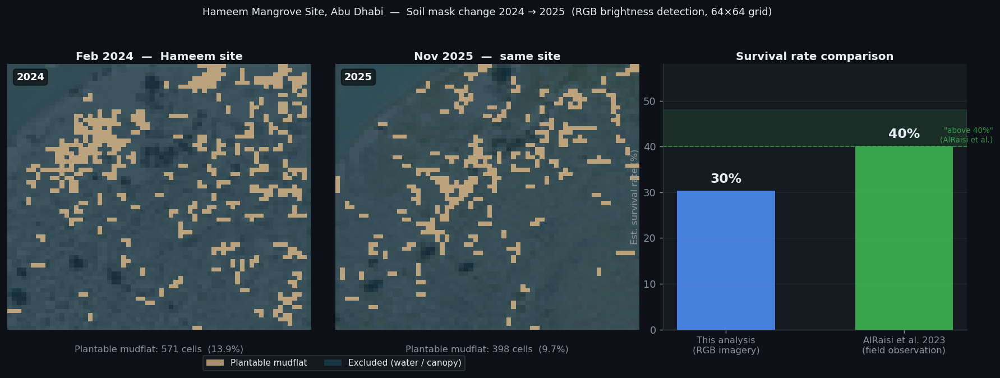

# Mangrove Reforestation Fleet — AI-Coordinated Seed Dispersal

An adaptive drone fleet planning system for large-scale mangrove restoration on coastal mudflats. The fleet plans missions from aerial imagery, operates under hard tidal deadlines, and replans in real time when drones fail or conditions change.

Built on a failure-aware optimization framework. Tidal windows are not soft preferences — they are hard cut-offs. When the surge arrives, whatever hasn't been planted is lost. The system is designed around that reality.

---

## Demo


*A 6-drone fleet seeds plantable mudflats following contour-aligned strips derived from real aerial imagery of Jubail Mangrove Park. Drones return to dock when the seed hopper empties, reload, and resume. When a tidal surge is detected, the AI coordinator reassigns remaining capacity to the highest-priority zones before the window closes.*

---

## The Problem

Restoring degraded coastal habitat at scale means planting millions of propagules across terrain that is:

- **Physically inaccessible** at the densities needed — soft mudflats impassable on foot
- **Time-constrained** — tidal cycles open and close viable planting windows within hours
- **Heterogeneous** — open water, existing canopy, and bare mudflat are interleaved; not all ground is plantable
- **Priority-sensitive** — areas near tidal channels have significantly higher germination rates; losing those strips to a planning gap is a disproportionate loss

A drone fleet without intelligent coordination is a fixed-route tool. When something goes wrong, the script breaks.

---

## Key Result


*Tidal surge arrives with 4 minutes remaining. Baseline plan: 14.1% overall coverage, 0.0% high-priority mudflat coverage. AI-adaptive plan: 13.3% overall coverage, **20.8% high-priority mudflat coverage**. The coordinator trades marginal overall coverage to protect the zones that matter for germination.*

---

## Mission Planner


*Mission Baseline tab: the aerial image is overlaid with the plantable cell mask — green cells are bare mudflat flagged for seeding, brown areas are excluded (canopy or water). The left panel sets detection thresholds (NDVI, blue-channel, brightness), strip mode (lawnmower or shore-first), row angle, fleet configuration, and seed parameters. Clicking any cell on the grid places the charging dock.*

All parameters feed directly into the planner and simulator. Adjusting NDVI or brightness thresholds immediately updates the plantable mask and strip count.

---

## Real-World Validation: Hameem Site, Abu Dhabi



The before/after aerial images from Distant Imagery Solutions cover the same section of the Hameem mangrove restoration site, photographed approximately 21 months apart (February 2024, November 2025). Running both images through the soil detection pipeline with identical thresholds produces a useful directional check: does the system correctly detect the growth that actually occurred?

- Feb 2024 plantable mudflat: 571 cells (13.9% of the frame)
- Nov 2025 plantable mudflat: 398 cells (9.7% of the frame)

The pipeline identifies substantially more dark canopy in the 2025 image — consistent with the real establishment visible in the photographs. This is the core function the app depends on: distinguishing existing canopy from bare mudflat to determine where dropping additional seeds makes sense. Areas already supporting canopy are correctly excluded as non-candidates; exposed sediment is flagged as plantable. The before/after comparison suggests the detector is picking up genuine ecological change rather than noise.

This is not a full validation of the method — the images differ in tidal state, the crop alignment isn't guaranteed, and RGB brightness cannot perfectly separate juvenile canopy from shadows or sediment texture. But it is at least *directionally* consistent with what happened on the ground.

**As an aside**, treating the converted cells as a rough proxy for establishment: 173 of the 571 (2024) plantable cells appear to have transitioned to canopy by 2025, implying ~30% establishment on reachable mudflat. A 2023 ADIPEC paper by AlRaisi et al. on ADNOC's drone-led mangrove restoration at Abu Dhabi sites reported survival rates "remained above 40%".<sup>1</sup> The ~30% figure from this single cropped frame sits in the same order of magnitude — plausible given the RGB-only method — but should not be read as a survival rate estimate. A [February 2023 article in The Ethicalist](https://theethicalist.com/drones-million-mangrove-abu-dhabi/) provides additional public context on the broader programme.

> <sup>1</sup> AlRaisi, A. A., Al Hameedi, S., AlBuainain, R. M., Glavan, J., and C. Rhodes. "Restoration Technology Hand in Hand With Nature-Based Solutions: ADNOC's Drone Led Mangrove Restoration Project." ADIPEC, Abu Dhabi, UAE, October 2023. [doi:10.2118/215963-MS](https://doi.org/10.2118/215963-MS)

---

## Soil Detection Pipeline


*Aerial imagery source: [Distant Imagery Solutions](https://www.linkedin.com/posts/distant-imagery-solutions_makeitintheemirates-uae-abudhabi-activity-7452634016509255680-j7p0) — Hameem mangrove restoration site, Abu Dhabi, UAE (Feb 2024 / Nov 2025). Used with reference to demonstrate real-world mangrove establishment patterns.*

The system takes a raw aerial RGB image and automatically identifies plantable mudflat, excluding open water and existing canopy:

1. **Pseudo-NDVI** from RGB channels — isolates tidal water (high NDVI threshold)
2. **Blue-channel filter** — backup exclusion for shallow tidal areas
3. **Brightness mask** — excludes dark canopy
4. **Plantable soil mask** — what remains is the planting surface (~26.9% of this field)

All thresholds are configurable. A production deployment would use actual NIR imagery for a true NDVI signal.

---

## Fleet Design


Before committing a fleet to a mission, the Fleet Design module runs Monte Carlo simulations across configurable parameters:

- **Config A** (6 drones, 35% failure probability): median 2,679 steps, worst-case 3,107
- **Config B** (8 drones, 40% failure probability): median 2,525 steps, worst-case 2,655

The takeaway here: 2 additional drones with a 5-point higher failure rate still cuts median mission time by 6% and worst-case time by 15%.

Adjustable parameters include drone count, seed spacing, wind speed (battery penalty), seed capacity per voyage, drone failure probability, and ecology survival rate.

---

## How It Works

```
Aerial image  (real or synthetic)
        ↓
Soil detector  (NDVI + blue + brightness masks → plantable cells)
        ↓
Strip generator  (lawnmower or contour-aligned strips)
        ↓
Fleet optimizer  (MILP makespan — with heuristic fallback)
        ↓
Simulation engine  (battery drain, seed hopper, drone failures, tidal deadlines)
        ↓
MCP event stream  (tidal surge alerts, tidal block reports → Claude coordinator)
        ↓
Visualization / metrics
```

### Planner Tiers

The system never halts on an infeasible plan:

| Mode | When triggered | Approach |
|---|---|---|
| **Full MILP** | Time available, stable state | Full horizon, hard battery and capacity constraints |
| **Degraded MILP** | Time pressure | Shorter horizon, skip unreliable drones |
| **Heuristic fallback** | Timeout or infeasible | Greedy nearest-strip — always fast, always produces a plan |

---

## AI Coordination

The AI coordinator connects to the simulation via MCP and acts as a live mission supervisor:

1. Reads current field state — what has been seeded, what remains
2. Receives tidal alerts — how long until the surge, which zones will be blocked
3. Designates high-priority strips as must-complete before the deadline
4. Requests a revised plan concentrating remaining fleet capacity on those strips
5. Reports the outcome with plain-language reasoning

The decision log shows not just what the system decided, but why — which field events triggered which actions.

---

## Quick Start

**Interactive UI (requires `ANTHROPIC_API_KEY` for AI coordination):**
```bash
python -m venv .venv && source .venv/bin/activate  # Windows: .venv\Scripts\activate
pip install -r requirements.txt

export ANTHROPIC_API_KEY=sk-ant-...
bash start_ui.sh
# Backend: http://localhost:8000
# Frontend: http://localhost:5173
```

**CLI (headless pipeline):**
```bash
python run_mangrove.py
# Runs full Abu Dhabi mangrove mission: soil detection → strip generation → MILP → simulation → GIF
```

**Notebook:**
```
notebooks/phase5_reforestation.ipynb  # End-to-end walkthrough with contour planting
```

---

## Tech Stack

| Layer | Library |
|---|---|
| Optimization | PuLP / OR-Tools |
| Simulation | Python (custom) |
| AI coordination | Claude via MCP (`anthropic` SDK) |
| Soil detection | numpy, Pillow (pseudo-NDVI from RGB) |
| Backend API | FastAPI + uvicorn |
| Frontend | React + Vite |
| Visualization | matplotlib |

---

## Honest Limitations

This is a research prototype built to demonstrate the planning and coordination architecture:

- **No real aircraft integration** — simulation uses representative parameters, not live telemetry
- **Static soil detection** — the aerial image is taken before the mission; dynamic tidal sensing during flight would need a live data feed
- **No regulatory layer** — geofencing, airspace deconfliction, and emergency protocols are not modeled
- **Survival rates are fixed estimates** — actual germination depends on factors well outside flight planning scope

These are integration problems, not architectural ones. The core loop — soil analysis, adaptive planning, failure-aware execution, AI-assisted coordination — is designed to be extended.

---

## Branch

This is the `reforestation` branch. The [`main` branch](../../tree/main) contains the agricultural use case: precision crop treatment, pest and weather event handling, and the full Monte Carlo degradation analysis.
